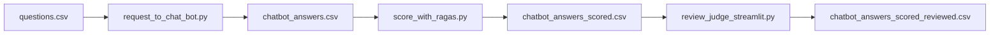

# Расчет метрик и оценка ответов AI-чат бота

## 1. Обзор проекта

Проект нужен для пакетной оценки ответов AI-чат бота на заранее подготовленных вопросах. Основной сценарий: загрузить вопросы из CSV, получить ответы чат-бота, посчитать метрики качества и вручную проверить, насколько корректно сработала judge-модель.



В проекте есть три пользовательских скрипта:

| Скрипт | Назначение |
|---|---|
| `request_to_chat_bot.py` | Отправляет вопросы из CSV в AI-чат бот и сохраняет ответы |
| `score_with_ragas.py` | Считает выбранные метрики качества ответов |
| `review_judge_streamlit.py` | Открывает Streamlit-интерфейс для ручной проверки judge-оценок |

Общая логика вынесена в пакет `llm_eval`:

| Файл | Что делает |
|---|---|
| `llm_eval/models.py` | Общие dataclass-модели, например `MetricResult` |
| `llm_eval/io.py` | Чтение/запись CSV, проверка колонок, формирование выходных схем |
| `llm_eval/chat_bot_client.py` | Клиент AI-чат бота, streaming response, retry-логика |
| `llm_eval/evaluators.py` | Метрики: final score, factual correctness, semantic similarity |
| `llm_eval/pipeline.py` | Batch-пайплайны для запросов к чат-боту и scoring |

Так CLI и Streamlit используют одну и ту же core-логику, а не дублируют чтение CSV, сохранение результатов, обработку ошибок и расчет метрик.

## 2. Установка

В папке проекта:

```bash
uv sync
```

Проверка окружения:

```bash
uv run python --version
uv run python request_to_chat_bot.py --help
uv run python score_with_ragas.py --help
uv run streamlit --version
```

Для запросов к AI-чат боту нужен `.env`. В PowerShell его можно создать по примеру так:

```powershell
Copy-Item .env.example .env
```

В bash аналогичная команда:

```bash
cp .env.example .env
```

Пример `.env.example`:

```text
AUTH_TOKEN=your_chat_bot_auth_token_here

JUDGE_BASE_URL=http://192.168.15.182:1234/v1
JUDGE_API_KEY=sk-no-key-required
```

`AUTH_TOKEN` используется в запросах к чат-боту как:

```text
Authorization: Token AUTH_TOKEN
```

## 3. Пример использования

### 3.1. Минимальный входной CSV для `request_to_chat_bot.py`

Самая простая таблица должна содержать минимум две колонки:

| question | expected_answer |
|---|---|
| Как загрузить табеля вручную? | Для ручной загрузки нужно зайти в транзакцию ... |

Рекомендуемый входной CSV:

| Колонка | Обязательная | Описание |
|---|---:|---|
| `id` | Нет | Идентификатор вопроса |
| `domain` | Нет | Предметная область или клиент |
| `question` | Да | Вопрос, который будет отправлен в чат-бот |
| `context` | Нет | Дополнительный контекст для анализа |
| `expected_answer` | Да | Эталонный ответ для дальнейшей оценки |
| `manual_final_score` | Нет | Ручная итоговая оценка |
| `manual_comment` | Нет | Ручной комментарий |
| `error` | Нет | Техническая ошибка, если была |

Пример тестового запуска на 3 вопросах:

```bash
uv run python request_to_chat_bot.py \
  --input data/input_questions.csv \
  --output data/chatbot_answers_test.csv \
  --limit 3 \
  --delay 2 \
  --save-every 1
```

Запуск на весь файл:

```bash
uv run python request_to_chat_bot.py \
  --input data/input_questions.csv \
  --output data/chatbot_answers.csv \
  --delay 2 \
  --retry-delays 2,5,10 \
  --timeout 300 \
  --save-every 1
```

Продолжить после остановки:

```bash
uv run python request_to_chat_bot.py \
  --input data/chatbot_answers.csv \
  --output data/chatbot_answers.csv \
  --skip-existing \
  --delay 2 \
  --retry-delays 2,5,10 \
  --timeout 300 \
  --save-every 1
```

`failed to answer` не считается заполненным ответом, поэтому такие строки будут повторно отправлены при `--skip-existing`.

### 3.2. Выходной CSV после `request_to_chat_bot.py`

Скрипт сохраняет компактную таблицу:

| Колонка | Описание |
|---|---|
| `id` | Идентификатор вопроса |
| `domain` | Предметная область или клиент |
| `question` | Исходный вопрос |
| `context` | Дополнительный контекст |
| `expected_answer` | Эталонный ответ |
| `model_answer` | Ответ AI-чат бота |
| `manual_final_score` | Ручная итоговая оценка |
| `manual_comment` | Ручной комментарий |
| `latency_sec` | Время ответа чат-бота в секундах |
| `created_at` | Время записи ответа |
| `error` | Техническая ошибка запроса |

Если запрос упал, строка выглядит примерно так:

```text
model_answer = failed to answer
error = SSLError: ...
```

### 3.3. Входной CSV для `score_with_ragas.py`

Входом для scoring является выходной CSV из `request_to_chat_bot.py`.

Обязательные колонки:

| Колонка | Описание |
|---|---|
| `question` | Исходный вопрос |
| `expected_answer` | Эталонный ответ |
| `model_answer` | Ответ чат-бота |

Остальные колонки сохраняются или отбрасываются в зависимости от выходной схемы выбранных метрик.

### 3.4. Тестовый scoring

Тест на 3 строках только для `ragas_final_score`:

```bash
uv run python score_with_ragas.py \
  --input data/chatbot_answers.csv \
  --output data/chatbot_answers_scored_test.csv \
  --metrics ragas_final_score \
  --judge-model qwen3.5-397b-a17b \
  --limit 3 \
  --save-every 1
```

Запуск на весь файл:

```bash
uv run python score_with_ragas.py \
  --input data/chatbot_answers.csv \
  --output data/chatbot_answers_scored.csv \
  --metrics ragas_final_score \
  --judge-model qwen3.5-397b-a17b \
  --skip-existing \
  --save-every 1
```

Запуск батчами по 20 новых строк:

```bash
uv run python score_with_ragas.py \
  --input data/chatbot_answers_scored.csv \
  --output data/chatbot_answers_scored.csv \
  --metrics ragas_final_score \
  --judge-model qwen3.5-397b-a17b \
  --skip-existing \
  --max-new 20 \
  --save-every 1
```

Запуск всех текущих метрик:

```bash
uv run python score_with_ragas.py \
  --input data/chatbot_answers.csv \
  --output data/chatbot_answers_scored.csv \
  --metrics ragas_factual_correctness,ragas_semantic_similarity,ragas_final_score \
  --judge-model gemma-4-31b-it-mlx \
  --skip-existing \
  --save-every 1
```

### 3.5. Выходной CSV после `score_with_ragas.py`

Выходная таблица динамически зависит от `--metrics`.

Если выбрана только:

```bash
--metrics ragas_final_score
```

то выходной CSV содержит:

| Колонка | Описание |
|---|---|
| `id` | Идентификатор вопроса |
| `domain` | Предметная область |
| `question` | Исходный вопрос |
| `context` | Дополнительный контекст |
| `expected_answer` | Эталонный ответ |
| `model_answer` | Ответ чат-бота |
| `ragas_final_score` | Judge-оценка по шкале 0/1/2 |
| `ragas_final_explanation` | Короткое объяснение judge-модели |
| `manual_final_score` | Ручная итоговая оценка |
| `manual_comment` | Ручной комментарий |
| `judge_model` | Модель, которая использовалась как judge |
| `error` | Ошибка запроса или scoring |

Если выбрана только:

```bash
--metrics ragas_semantic_similarity
```

то `judge_model` не добавляется, потому что эта метрика использует embedding-модель, а не LLM-as-a-judge.

### 3.6. Метрики

| Метрика | Что считает | Требует judge LLM |
|---|---|---:|
| `ragas_final_score` | Кастомная оценка 0/1/2 по эталону | Да |
| `ragas_factual_correctness` | Ragas FactualCorrectness через claims и F1 | Да |
| `ragas_semantic_similarity` | Cosine similarity между embedding `expected_answer` и `model_answer` | Нет |

`ragas_final_score` использует шкалу:

| Score | Значение |
|---:|---|
| `2` | Ответ полностью правильный |
| `1` | Ответ частично правильный |
| `0` | Ответ неправильный |

Для judge-моделей используется разный формат ответа:

| Judge model | Формат |
|---|---|
| `gemma-4-31b-it-mlx` | JSON schema / structured output |
| `qwen3.5-397b-a17b` | line-based `SCORE` / `EXPLANATION` |
| `qwen3.5-vl-122b-a10b-mlx-crack` | line-based `SCORE` / `EXPLANATION` |
| `qwen/qwen3.6-35b-a3b` | line-based `SCORE` / `EXPLANATION` |

Если judge не смог корректно вернуть score, весь батч не падает. Скрипт пишет ошибку в `error`, оставляет score/explanation пустыми и идет дальше. Такие строки можно пересчитать следующим запуском с `--skip-existing`.

### 3.7. Streamlit для ручной проверки judge

После scoring можно вручную проверить, насколько корректно judge-модель поставила оценки:

```bash
uv run streamlit run review_judge_streamlit.py -- \
  --input data/chatbot_answers_scored.csv \
  --output data/chatbot_answers_scored_reviewed.csv \
  --reviewer v.makarov
```

Streamlit показывает:

| Блок | Что отображается |
|---|---|
| Вопрос | `question`, `domain`, `id` |
| Эталон | `expected_answer` |
| Ответ чат-бота | `model_answer` |
| Judge | `ragas_final_score`, `ragas_final_explanation`, `judge_model` |
| Ручная проверка | `judge_verdict_correct`, `judge_review_comment` |

В reviewed CSV добавляются:

| Колонка | Описание |
|---|---|
| `judge_verdict_correct` | `yes`, `no` или `unsure` |
| `judge_review_comment` | Комментарий ревьюера |
| `reviewed_at` | Время ручной проверки |
| `reviewer` | Имя ревьюера |

Фильтры в интерфейсе помогают смотреть:

```text
непроверенные строки
score = 0 / 1 / 2
строки с error
случаи, где judge_verdict_correct = no
```

## 4. Параметры скриптов

### 4.1. `request_to_chat_bot.py`

| Параметр | По умолчанию | Описание |
|---|---|---|
| `--input` | `RAG_questions_answers.csv` | Входной CSV с вопросами |
| `--output` | `AI_chat_bot_answers.csv` | Выходной CSV с ответами чат-бота |
| `--url` | `https://ai.sapiens.solutions/api/v1/conversations/ask/stream` | Endpoint AI-чат бота |
| `--env-file` | `.env` | Файл с `AUTH_TOKEN` |
| `--delimiter` | `;` | Разделитель CSV |
| `--timeout` | `300` | Timeout одного HTTP-запроса в секундах |
| `--limit` | `None` | Обработать только первые N строк |
| `--save-every` | `1` | Сохранять результат каждые N обработанных строк |
| `--delay` | `0.0` | Пауза между вопросами в секундах |
| `--retry-delays` | `2,5,10` | Задержки между retry при сетевых ошибках |
| `--skip-existing` | `False` | Пропускать строки с уже заполненным `model_answer` |

### 4.2. `score_with_ragas.py`

| Параметр | По умолчанию | Описание |
|---|---|---|
| `--input` | `qwenqwen3535b_answers.csv` | Входной CSV с ответами чат-бота |
| `--output` | `qwenqwen3535b_answers_ragas.csv` | Выходной CSV с метриками |
| `--delimiter` | `;` | Разделитель CSV |
| `--judge-base-url` | `http://192.168.15.182:1234/v1` | OpenAI-compatible endpoint judge-модели |
| `--judge-api-key` | `sk-no-key-required` | API key для judge endpoint |
| `--judge-model` | `gemma-4-31b-it-mlx` | Модель, используемая как judge |
| `--judge-temperature` | `0.0` | Temperature judge-модели |
| `--judge-max-tokens` | `8192` | Максимум токенов для ответа judge |
| `--request-timeout` | `300` | Timeout запроса к judge-модели |
| `--embedding-model` | `sentence-transformers/paraphrase-multilingual-MiniLM-L12-v2` | Hugging Face repo embedding-модели |
| `--embedding-onnx-file` | `auto` | ONNX-файл внутри repo; `auto` выбирает подходящий |
| `--embedding-cache-dir` | `.hf-cache` | Папка кеша Hugging Face |
| `--embedding-max-length` | `256` | Максимальная длина текста для tokenizer |
| `--metrics` | `ragas_factual_correctness,ragas_semantic_similarity,ragas_final_score` | Список метрик через запятую |
| `--limit` | `None` | Взять только первые N строк до применения `--skip-existing` |
| `--max-new` | `None` | Обработать максимум N новых строк после `--skip-existing` |
| `--save-every` | `1` | Сохранять результат каждые N обработанных строк |
| `--skip-existing` | `False` | Пропускать строки, где уже заполнены выбранные метрики |

Допустимые значения `--metrics`:

| Короткое имя | Полное имя |
|---|---|
| `factual_correctness` | `ragas_factual_correctness` |
| `semantic_similarity` | `ragas_semantic_similarity` |
| `final_score` | `ragas_final_score` |

Для `ragas_final_score` строка считается заполненной только если заполнены оба поля:

```text
ragas_final_score
ragas_final_explanation
```

### 4.3. `review_judge_streamlit.py`

Запускается через `streamlit run`, поэтому параметры скрипта передаются после `--`:

```bash
uv run streamlit run review_judge_streamlit.py -- \
  --input data/chatbot_answers_scored.csv \
  --output data/chatbot_answers_scored_reviewed.csv \
  --reviewer v.makarov
```

| Параметр | По умолчанию | Описание |
|---|---|---|
| `--input` | `data/forqwen_judge_scored_qwen397b.csv` | Scored CSV для ручной проверки |
| `--output` | `<input>_reviewed.csv` | Файл, куда сохраняется ручное ревью |
| `--delimiter` | `;` | Разделитель CSV |
| `--reviewer` | пусто | Имя ревьюера, записывается в колонку `reviewer` |

## 5. Стек

Проект использует `uv` и Python 3.12.

```text
.python-version = 3.12
requires-python = >=3.10,<3.13
```

| Библиотека | Для чего используется |
|---|---|
| `requests` | HTTP-запросы к AI-чат боту |
| `python-dotenv` | Чтение `.env` |
| `pandas` | CSV, таблицы, промежуточные датасеты |
| `numpy` | Расчет cosine similarity |
| `openai` | OpenAI-compatible клиент для judge-моделей |
| `ragas` | Factual correctness и Ragas-интеграции |
| `instructor` | Structured output для judge-моделей, приходит через зависимости Ragas |
| `onnxruntime` | Локальный запуск embedding-модели |
| `transformers` | Tokenizer для embedding-модели |
| `huggingface-hub` | Загрузка ONNX embedding-модели |
| `streamlit` | Web UI для ручной проверки judge |
| `jupyter`, `notebook`, `ipykernel` | Работа в ноутбуках |
| `matplotlib`, `seaborn` | Анализ и визуализация |
| `openpyxl` | Работа с Excel |

Предупреждение вида:

```text
PyTorch was not found
```

для текущего embedding workflow не критично: PyTorch не нужен, потому что embedding-модель запускается через ONNX Runtime, а `transformers` используется только для tokenizer.
